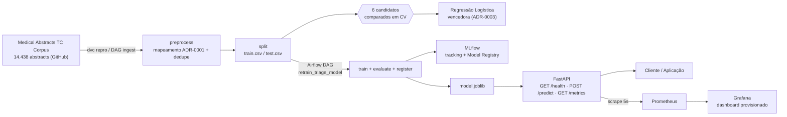
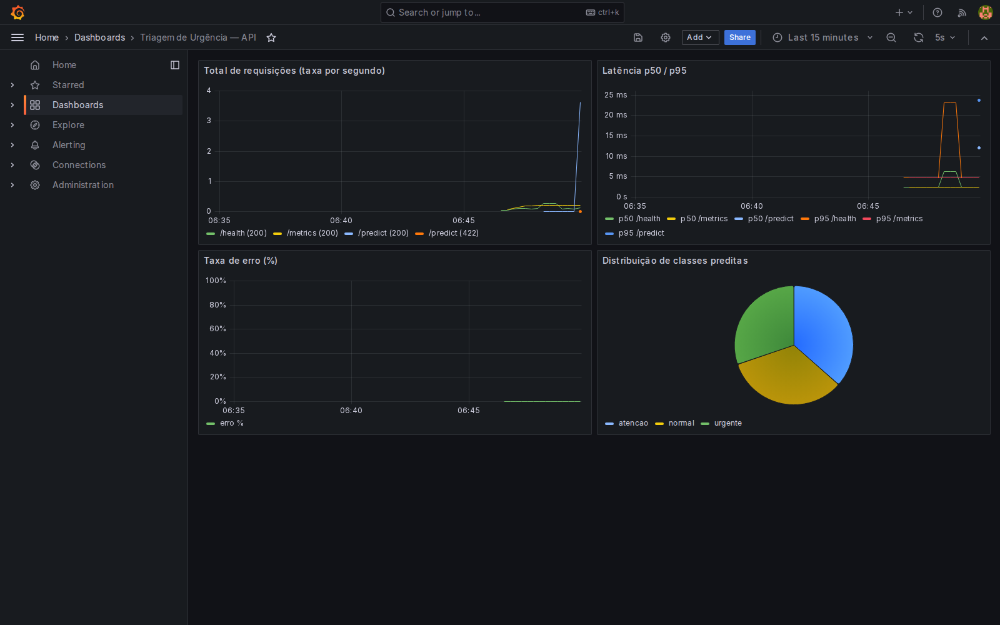

<div align="center">

# Medical Triage NLP

Classificador de texto (NLP) leve para triagem de urgência de laudos médicos, servido via API REST com pipeline de CI/CD, orquestração de retreino e monitoramento

[Resultados](#resultados) | [Pipeline](#pipeline) | [Instalação](#instalação) | [Docker](#docker) | [Monitoramento](#monitoramento) | [API](#api-de-inferência) | [Documentação](#documentação) | [Roadmap](#roadmap)

Ferramentas:


Detalhes:

[](https://github.com/NycolasGarcia/Medical-Triage-NLP/actions/workflows/ci.yml)


-0.523-blue?style=flat)
-0.880-blue?style=flat)

</div>

## Sobre o Projeto

Projeto da **Fase 3 do Tech Challenge** da Pós Tech em Machine Learning Engineering
(FIAP MLET). Um hospital de referência precisa de um sistema de triagem automática
de laudos médicos em texto, classificando a urgência em três faixas ordinais —
`normal < atenção < urgente` — para reduzir o tempo até o atendimento de casos
graves. O tema central da fase não é o modelo em si, e sim o **ciclo de vida em
produção**: pipeline CI/CD, orquestração de retreino, monitoramento e otimização
de latência.

> **Projeto em desenvolvimento incremental por fases** (F0–F7). O que este README
> descreve já está implementado e testado; o que ainda não existe é marcado como
> tal, não omitido. Progresso completo, checkpoints e evidências em
> [docs/PROGRESS.md](docs/PROGRESS.md).

## Dataset

**Medical Abstracts TC Corpus** ([GitHub `sebischair/Medical-Abstracts-TC-Corpus`](https://github.com/sebischair/Medical-Abstracts-TC-Corpus))
— abstracts médicos em **inglês**, classificados por sistema/condição (neoplasias,
doenças digestivas, do sistema nervoso, cardiovasculares, condições patológicas
gerais). 14.438 registros brutos → 11.225 após dedupe (exato + near-duplicate) →
8.980 treino / 2.245 teste, split estratificado com seed fixa.

O corpus **não** traz rótulo de urgência clínica — a faixa `normal/atenção/urgente`
é derivada por um mapeamento heurístico e didático, **não validado clinicamente**
([ADR-0001](docs/adr/0001-mapeamento-classes-urgencia.md)).

> **Idioma:** o texto de entrada esperado é **inglês** (idioma do dataset
> recomendado pelo enunciado). A documentação do projeto é em português, mas API,
> exemplos e demo usam inglês por decisão consciente — não é bug, ver
> [Model Card](docs/model_card.md) (limitação 2).
>
> Dataset não é versionado no git — baixado direto da fonte (sem credencial) via
> `dvc repro`. Dicionário completo em [docs/data_card.md](docs/data_card.md).

## Análise de Custo

Como as classes são ordinais, dois erros têm custo muito diferente: **sub-triagem**
(`urgente` classificado como `atenção`/`normal` — atraso no atendimento a paciente
crítico) e **sobre-triagem** (`normal` classificado acima — custa tempo de equipe,
não risco). Matriz explícita ([ADR-0005](docs/adr/0005-matriz-custo-politica-limiar.md)):
sub-triagem de 1 nível = 5, de 2 níveis = 15; sobre-triagem = 1–2 — sub-triagem
custa 5-15× mais porque é o erro perigoso.

A API decide por um **limiar cumulativo tunado sobre essa matriz**, não por
probabilidade máxima (`src/models/threshold.py`): no teste reservado, isso derruba
sub-triagem de 10,3% para **4,3%** e o custo médio em **48%** (1,290 → 0,672) — ao
custo de mais sobre-triagem (15,9% → 32,6%) e do recall de `normal` caindo para
**0,04** (efeito colateral matematicamente esperado da assimetria, mantido
deliberadamente após revisão — ver [ADR-0005](docs/adr/0005-matriz-custo-politica-limiar.md)).

> Leitura completa (matriz, busca de limiar, achados qualitativos de erro) em
> [docs/EXPERIMENTS.md](docs/EXPERIMENTS.md), [docs/error_analysis.md](docs/error_analysis.md)
> e [docs/model_card.md](docs/model_card.md).

## Reprodutibilidade

Seed fixa (`42`) em dedupe/split (`src/data/split.py`), validação cruzada e todos os
candidatos (`src/models/factory.py`) — comparação de modelos reproduzida bit-a-bit
entre duas máquinas diferentes nesta sessão de desenvolvimento (mesmos valores de
F1-macro na precisão exibida).

## Resultados

Modelo em produção: **TF-IDF + Regressão Logística** — venceu entre 6 candidatos
comparados sob a mesma validação cruzada de 5 dobras
([ADR-0003](docs/adr/0003-escolha-modelo-base.md)).

<div align="center">

### Validação cruzada (F2) — todos os candidatos comparados

| Modelo | F1 macro | F1 weighted | Recall `urgente` | ROC-AUC OvR | Sub-triagem |
|---|---|---|---|---|---|
| DummyClassifier | 0,339 | 0,339 | 0,351 | 0,504 | 32,9% |
| **Regressão Logística (campeão)** | **0,731** | **0,733** | 0,796 | **0,877** | 11,8% |
| LinearSVC calibrado | 0,723 | 0,726 | 0,794 | 0,873 | 11,6% |
| LightGBM | 0,708 | 0,711 | 0,754 | 0,867 | 13,6% |
| Random Forest | 0,687 | 0,691 | 0,774 | 0,856 | 11,9% |
| Multinomial Naive Bayes | 0,675 | 0,679 | **0,863** | 0,863 | **6,9%** |

### Teste reservado — primeira avaliação real (nunca tocado desde F1)

| Métrica | CV (F2) | Teste reservado |
|---|---|---|
| F1 macro | 0,731 | 0,728 |
| ROC-AUC OvR | 0,877 | 0,878 |
| Recall `urgente` | 0,796 | 0,769 |

</div>

> Leitura honesta: Multinomial NB tem a menor sub-triagem de todos os candidatos
> reais (6,9%), à custa de mais sobre-triagem — não é o vencedor de F2 (F1-macro
> mais baixo do grupo), mas é o principal candidato a revisitar quando a matriz de
> custo de F6 existir. Diferença pequena entre CV e teste reservado (< 3 pontos em
> tudo) é bom sinal de generalização, não coincidência forçada.

### F6 — pipeline final (representação + calibração + limiar de custo)

A tabela acima é F2: modelo escolhido, sem as técnicas de F6. O pipeline que a API
serve por padrão hoje é mais além — representação tunada (bigramas + char
n-gramas + marcação de negação, [EXPERIMENTS.md](docs/EXPERIMENTS.md)), calibração
isotônica ([EXPERIMENTS.md](docs/EXPERIMENTS.md)) e limiar de decisão enviesado
contra sub-triagem via matriz de custo explícita
([ADR-0005](docs/adr/0005-matriz-custo-politica-limiar.md)):

| Métrica (teste reservado) | Antes de F6 (argmax, TF-IDF simples) | Depois de F6 (limiar tunado) |
|---|---|---|
| Recall `urgente` | 0,769 | **0,880** |
| Custo médio (matriz §7) | 1,290 | **0,672** (-48%) |
| Sub-triagem | ~10,8% | **4,3%** |
| F1 macro | 0,728 | 0,523 |

**F1-macro caiu — de propósito, não é regressão.** O limiar tunado troca
deliberadamente qualidade agregada por menos sub-triagem (o erro que importa neste
domínio, §7): o recall de `normal` desaba para 0,04 como efeito colateral
matematicamente esperado da assimetria de custo (sub-triagem custa 5-15×
sobre-triagem) — analisado em detalhe, com exemplos reais lidos manualmente, em
[docs/error_analysis.md](docs/error_analysis.md) e na decisão final do autor
registrada em [ADR-0005](docs/adr/0005-matriz-custo-politica-limiar.md).

## Pipeline



## Stack

<div align="center">

| Camada | Tecnologia | Papel |
|---|---|---|
| Dados | pandas | Leitura, limpeza, dedupe (exato + near-duplicate) |
| Versionamento de dados | DVC ≥ 3.67 | Pipeline de 3 estágios (`dvc.yaml`), remote local |
| Vetorização | scikit-learn (TF-IDF) | Strategy trocável (`src/features/vectorize.py`) |
| Modelo em produção | scikit-learn ≥ 1.9 | Regressão Logística — vencedora honesta entre 6 candidatos |
| Candidatos comparados | scikit-learn + LightGBM | Dummy, LogReg, RandomForest, MultinomialNB, LightGBM, LinearSVC calibrado |
| Tracking + Registry | MLflow ≥ 3.16 | Params/métricas/artefatos por run; registro de versão do modelo |
| Orquestração | Apache Airflow ≥ 3.2 | DAG `retrain_triage_model`: ingest → preprocess → train → evaluate → register |
| API | FastAPI + Uvicorn, Pydantic | `/health`, `/predict`, `/metrics`, middleware de latência |
| Métricas | `prometheus_client` | Contadores/histograma expostos em `/metrics` |
| Otimização de latência | ONNX Runtime + skl2onnx | Backend `onnx` opt-in, -58,3% no p95 (ADR-0004) |
| Monitoramento | Prometheus 2.53 + Grafana 11.1 | Scrape 5s + dashboard provisionado como código (4 painéis) |
| Validação de dados | pandera | Schema do dataset processado |
| Logging | JSON estruturado | Sem `print()` em nenhum módulo |
| Qualidade | ruff, pre-commit | Lint + mccabe (complexidade), zero erros |
| Testes | pytest, pytest-cov, httpx | 77 testes, 63% cobertura em `src/` |
| Container | Docker multi-stage + Compose | API + Prometheus + Grafana, usuário não-root, `HEALTHCHECK` nos 3 |

</div>

## Instalação

```bash
# 1. Clonar o repositório
git clone https://github.com/NycolasGarcia/Medical-Triage-NLP.git
cd Medical-Triage-NLP

# 2. Instalar dependências (uv) — inclui o grupo `training` (mlflow/lightgbm/mord)
make setup

# 3. Configurar ambiente
cp .env.example .env

# 4. Baixar e processar o dataset (sem credencial — fonte pública)
uv run dvc repro

# 5. Treinar e persistir os dois backends (sklearn padrão + onnx opcional)
make train
make train-onnx
```

## Quick Start

```bash
make lint            # ruff check
make test            # pytest (77 testes)

make run             # API com reload -> http://localhost:8000/docs
make train            # treina e persiste o backend sklearn (padrão)
make train-onnx       # exporta o backend onnx (opt-in, ver ADR-0004)
make bench            # benchmark de latência (docs/LATENCY.md)

make stack-up         # API + Prometheus + Grafana -> http://localhost:3000
make load-test         # gera tráfego pra popular o dashboard
```

### Makefile

<div align="center">

| Comando | O que faz |
|---|---|
| `make setup` | `uv sync --group training` + `pre-commit install` |
| `make lint` | `ruff check .` |
| `make test` | Suíte pytest completa |
| `make train` | Treina e persiste o backend `sklearn` (`src/models/train.py`) |
| `make train-onnx` | Exporta o backend `onnx` (`src/optimization/onnx_export.py`) |
| `make run` | Sobe a API local com reload (`uvicorn`) |
| `make bench` | Benchmark de latência do `/predict` (`scripts/benchmark.py`) |
| `make stack-up` / `stack-down` | `docker compose up -d` / `down` — API + Prometheus + Grafana |
| `make load-test` | Gera tráfego contra a API (`scripts/load_test.py`) |

</div>

## Docker

```bash
docker build -t medical-triage-nlp .
docker run -d -p 8000:8000 medical-triage-nlp
curl localhost:8000/health   # ou: http://localhost:8000/docs
```

`Dockerfile` multi-stage (builder com `uv sync --no-dev` + runtime `python:3.11-slim`,
usuário não-root, `HEALTHCHECK` contra `/health`). Imagem atual: **696 MB** (era
1,03 GB em F3 — dependências de treino/experimentação, `mlflow`/`lightgbm`/`mord`,
separadas do serving em F6/ADR-0004, ver [docs/LATENCY.md](docs/LATENCY.md)).
Latência medida dentro do container (backend `sklearn`, padrão): **p50 6,47 ms ·
p95 7,01 ms**; backend `onnx` (`MODEL_BACKEND=onnx`, ver
[ADR-0004](docs/adr/0004-tecnica-otimizacao-latencia.md)): **p50 2,57 ms · p95
2,92 ms** (**-58,3%**) — protocolo completo e trade-off de qualidade em
`docs/LATENCY.md`.

## Monitoramento

```bash
make stack-up      # API + Prometheus + Grafana, docker-compose.yml
make load-test      # gera tráfego real pra popular o dashboard
```

<div align="center">

| Serviço | URL | Credenciais |
|---|---|---|
| API | http://localhost:8000/docs | — |
| Métricas | http://localhost:8000/metrics | — |
| Prometheus | http://localhost:9090 | — |
| Grafana | http://localhost:3000/d/triagem-urgencia | admin / admin |

</div>

Datasource e dashboard **provisionados como código** (`monitoring/grafana/provisioning/`,
JSON commitado) — nada pra clicar manualmente. 4 painéis: total de requisições
(por rota/status), latência p50/p95, taxa de erro e distribuição de classes
preditas (métrica de negócio, base pra detectar drift). Print com dado real:



## MLflow e Model Registry

- Experimento: `triagem-urgencia`, backend `sqlite:///mlflow.db`. Dezenas de runs
  rastreados ao longo do projeto (6 candidatos de F2, buscas de representação/
  calibração/limiar/custo de F6, exports ONNX), todos com parâmetros, métricas e
  artefatos.
- Modelo registrado no Model Registry a cada execução da DAG/`scripts/promote_model.py`,
  com tags `recall_urgente`/`mean_cost`/`elegivel_promocao` calculadas pelo
  critério de [ADR-0010](docs/adr/0010-criterio-promocao-atualizado-f6.md)
  (piso de recall de `urgente` + não regressão de custo médio — substituiu o
  piso de F1-macro de ADR-0008, que teria bloqueado o próprio modelo que
  ADR-0005 decidiu servir). **Promoção é gate humano, não automática**
  (`--promote` explícito) — versão **5** promovida a `@production`.

## Documentação

<div align="center">

| Documento | Conteúdo |
|---|---|
| [docs/model_card.md](docs/model_card.md) | Model Card: performance, política de decisão, limitações (incl. idioma), vieses, cenários de falha |
| [docs/data_card.md](docs/data_card.md) | Origem, licença, distribuição, mapeamento de rótulo do dataset |
| [docs/EXPERIMENTS.md](docs/EXPERIMENTS.md) | Tabela comparativa de todos os candidatos/buscas (F2 a F6) e leitura dos resultados |
| [docs/error_analysis.md](docs/error_analysis.md) | Análise qualitativa dos erros — achado principal: teto de qualidade do mapeamento de rótulo |
| [docs/LATENCY.md](docs/LATENCY.md) | Protocolo de benchmark, resultados sklearn vs. ONNX e trade-off de qualidade |
| [docs/ARCHITECTURE.md](docs/ARCHITECTURE.md) | Componentes, diagramas de fluxo de inferência e de treino |
| [docs/adr/](docs/adr/) | Architecture Decision Records: ADR-0001 a ADR-0010 |
| [docs/PROGRESS.md](docs/PROGRESS.md) | Log de checkpoints por fase, com evidências e veredito |

</div>

## Notebooks

<div align="center">

| Notebook | Conteúdo |
|---|---|
| [01_eda.ipynb](notebooks/01_eda.ipynb) | Volume, distribuição de classes, duplicatas, vocabulário, termos discriminativos por classe |

</div>

## API de Inferência

Modelo carregado uma única vez no `lifespan` do FastAPI (startup, não por
requisição). Middleware loga `request_id`, latência e classe predita por requisição.

<div align="center">

| Método | Path | Descrição |
|---|---|---|
| `GET` | `/health` | Liveness check: `{"status": "ok"}` |
| `POST` | `/predict` | Recebe texto do laudo, retorna classe + probabilidades |
| `GET` | `/metrics` | Métricas Prometheus (requisições, latência, erros, classe predita) |
| `GET` | `/docs` | Swagger UI interativo (gerado automaticamente pelo FastAPI) |

</div>

**Testando via Swagger UI:** `make run`, abra `http://localhost:8000/docs`, expanda
`POST /predict`, **Try it out** e cole um payload abaixo (texto em **inglês** — ver
nota sobre idioma em [Dataset](#dataset)). Desde a caixa 6.4/ADR-0005, a API decide
por limiar deliberadamente enviesado contra sub-triagem, não por probabilidade
máxima — `normal` só sai com alta confiança (o segundo exemplo abaixo é um laudo
real do conjunto de teste, não uma frase curta sintética, porque frases curtas
ambíguas quase sempre escalam para `atenção` com o limiar atual).

<details>
<summary><strong>Laudo urgente</strong> — choque cardiogênico → <code>"label": "urgente"</code> (72,9%)</summary>

```json
{
  "text": "Patient presents with acute myocardial infarction and cardiogenic shock, severe hemodynamic instability."
}
```

</details>

<details>
<summary><strong>Laudo normal</strong> — infecção urinária pós-operatória, sem achados graves → <code>"label": "normal"</code> (98,5%)</summary>

```json
{
  "text": "Postoperative urinary tract infection in gynecology: implications for an antibiotic prophylaxis policy. A prospective observational study of postoperative infection after gynecologic surgery assessed the need for antibiotic prophylaxis with special reference to the urinary tract. Catheterization requirements in the postoperative period were compared with the development of urinary tract infection after excluding both preoperative and postoperative bacteriuria. Forty-six of 115 patients (40%) developed a urinary tract infection in the postoperative period. Furthermore, this was not clearly related to the need for postoperative catheterization. Significant wound and vaginal vault infections were uncommon, indicating that antibiotic prophylaxis should be directed specifically at the urinary tract."
}
```

</details>

## Estrutura do Projeto

```
medical-triage-nlp/
├── src/
│   ├── api/                   # FastAPI: main, schemas, model_runtime (flag sklearn/onnx)
│   ├── data/                  # load, labels, dedupe, split, prepare, schema
│   ├── features/               # vectorize (representação), negation, lexicon, structural
│   ├── models/                 # factory, train, evaluate, experiments, tracking
│   │   │                       # representation_tuning, calibration, cost(+comparison),
│   │   │                       # threshold(+search), promotion
│   ├── optimization/            # calibrator (isotônico manual), onnx_export, onnx_runtime
│   ├── monitoring/               # metrics.py — instrumentação Prometheus
│   ├── config.py, logging_config.py
├── airflow/dags/                # retrain_dag.py — retrain_triage_model
├── tests/                       # smoke, schema, API, features, models, optimization, ...
├── notebooks/                    # 01_eda.ipynb
├── scripts/                      # benchmark.py, load_test.py, promote_model.py
├── monitoring/                    # prometheus.yml, grafana/provisioning/ (datasource + dashboard)
├── docs/                          # ADRs, cards, EXPERIMENTS, LATENCY, ARCHITECTURE, PROGRESS, evidence/
├── data/                          # raw/ processed/ — não versionado no git
├── models/                        # artefatos (git-ignored; versionados via MLflow)
├── Dockerfile                      # multi-stage (builder + runtime)
├── docker-compose.yml               # API + Prometheus + Grafana
├── dvc.yaml / dvc.lock               # pipeline de dados (3 estágios)
├── .github/workflows/ci.yml           # lint → test → build
└── pyproject.toml                     # deps, ruff, pytest — single source of truth
```

## Roadmap

- [x] **Etapa 1 — Decisão Arquitetural e API Inicial**
  - [x] Estrutura de repo, `pyproject.toml` (uv), ruff + mccabe, logging estruturado, CI de lint
  - [x] Pipeline de dados reprodutível (DVC), ADR-0001 (mapeamento de rótulo), dedupe + split
  - [x] MLflow + 6 candidatos comparados em CV, ADR-0003 (escolha do modelo)
  - [x] API FastAPI (`/predict`, `/health`), Dockerfile multi-stage, latência baseline medida
  - [x] ADR-0002 (arquitetura de deploy: real-time, AWS ECS/Fargate teórico)
- [x] **Etapa 2 — CI/CD e Pipeline Automatizado**
  - [x] CI expandido: `lint` → `test` → `build`, verde no GitHub Actions, badge real no README
  - [x] Relatório de cobertura no CI
  - [x] DAG `retrain_triage_model` executada de ponta a ponta (5/5 tasks), registro no MLflow Model Registry
  - [x] RUNBOOK do Airflow completo + DAG parametrizada (`Param`) + ADR-0008 (critério de promoção)
- [x] **Etapa 3 — Monitoramento e Observabilidade**
  - [x] Instrumentação Prometheus (`/metrics`): requisições, latência, erros, classe predita
  - [x] `docker-compose.yml` (API + Prometheus + Grafana), os 3 serviços `healthy`
  - [x] Dashboard Grafana provisionado como código (4 painéis), gerador de carga, print com dado real
- [ ] **Etapa 4 — Otimização de Latência e Entrega**
  - [x] Tuning de representação (ADR implícito em EXPERIMENTS.md) + calibração isotônica (Brier/ECE medidos)
  - [x] Matriz de custo assimétrica + ajuste de limiar por classe (ADR-0005), análise qualitativa de erros
  - [x] Export ONNX + benchmark comparativo (-58,3% no p95), backend alternável por flag (ADR-0004)
  - [x] Promoção do modelo no Registry (ADR-0010, critério atualizado — versão 5 em `@production`)
  - [x] Model Card final ([docs/model_card.md](docs/model_card.md)), README final
  - [ ] Vídeo STAR (≤ 5 min)

Progresso completo (checkpoints, portões numéricos, evidências) em
[docs/PROGRESS.md](docs/PROGRESS.md).

## Contato

<div align="center">

| Plataforma | Link |
|---|---|
|  | [LinkedIn](https://www.linkedin.com/in/NycolasAGRGarcia/) |
|  | [GitHub](https://github.com/NycolasGarcia) |
|  | [Gmail](mailto:nycolasagrg.work@gmail.com) |
|  | [Portfólio](https://dev-nycolas-garcia.vercel.app/) |

</div>
