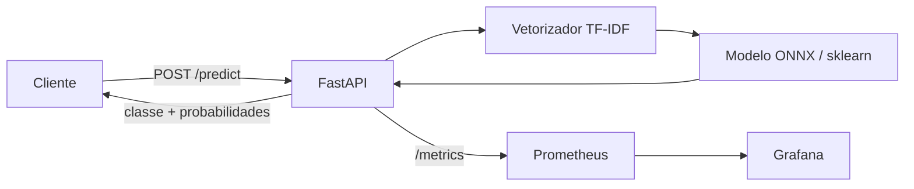
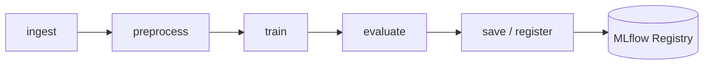

# Arquitetura

> Esqueleto criado em F0. Preencher de verdade em F3 (fluxo de inferência) e
> F4/F5 (retreino e observabilidade). Decisões que geraram esta arquitetura
> estão em `adr/` — aqui descreve-se o **como está**, lá o **por quê**.

## 1. Visão geral

Sistema de triagem de urgência de laudos médicos: classificador NLP leve servido por
API REST em container, com retreino orquestrado e observabilidade local.

## 2. Componentes

| Componente | Tecnologia | Porta | Responsabilidade |
|---|---|---|---|
| API de inferência | FastAPI + Uvicorn | 8000 | `/predict`, `/health`, `/metrics` |
| Prometheus | Prometheus | 9090 | Coleta de métricas da API |
| Grafana | Grafana | 3000 | Dashboard de requisições, latência e erro |
| Orquestrador | Airflow | 8080 | DAG de ingestão, treino e promoção |
| Tracking | MLflow | 5000 | Experimentos e Model Registry |

## 3. Fluxo de inferência



Modelo e vetorizador são carregados **no startup**, não por requisição (ADR pendente
de registro em F3).

## 4. Fluxo de treino / retreino



Critério de promoção do modelo: ver ADR-0008.

## 5. Contratos

`POST /predict`

```json
{ "text": "laudo em texto livre" }
```

```json
{ "label": "urgente", "probabilities": {"normal": 0.05, "atencao": 0.20, "urgente": 0.75}, "model_version": "1.3.0" }
```

## 6. Decisões vinculadas

| ADR | Decisão |
|---|---|
| 0001 | Mapeamento de classes para urgência |
| 0002 | Arquitetura de deploy (batch vs. real-time) |
| 0003 | Modelo base |
| 0004 | Técnica de otimização de latência |
| 0005 | Matriz de custo e política de limiar |
| 0008 | Estratégia de retreino e promoção |
