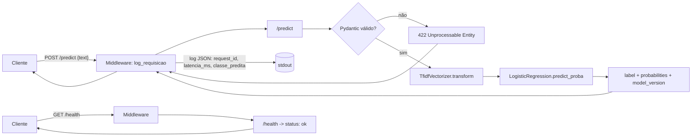
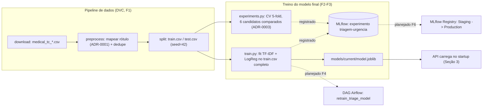

# Arquitetura

> Esqueleto criado em F0, preenchido com o fluxo real em F3. Decisões que geraram
> esta arquitetura estão em `adr/` — aqui descreve-se o **como está**, lá o **por
> quê**. Elementos marcados "planejado" ainda não existem no repositório; os
> diagramas usam seta tracejada (`-.->`) para eles.

## 1. Visão geral

Sistema de triagem de urgência de laudos médicos: classificador NLP leve (TF-IDF +
Regressão Logística, ver ADR-0003) servido por API REST em container, com retreino
orquestrado e observabilidade local.

## 2. Componentes

| Componente | Tecnologia | Porta | Responsabilidade | Status |
|---|---|---|---|---|
| API de inferência | FastAPI + Uvicorn | 8000 | `/predict`, `/health` | **implementado (F3)** |
| Container | Docker (multi-stage) | — | Empacota a API para deploy | **implementado (F3)** |
| Métricas | `prometheus_client` (`/metrics`) | 8000 | Expor contadores/histogramas | planejado (F5) |
| Prometheus | Prometheus | 9090 | Coleta de métricas da API | planejado (F5) |
| Grafana | Grafana | 3000 | Dashboard de requisições, latência e erro | planejado (F5) |
| Orquestrador | Airflow | 8080 | DAG de ingestão, treino e promoção | planejado (F4) |
| Tracking | MLflow | 5000 (UI local) | Experimentos (já em uso) e Model Registry | tracking **em uso (F2/F3)**; Registry planejado (F6) |

## 3. Fluxo de inferência (implementado em F3)



**Startup (não por requisição):** o `lifespan` do FastAPI carrega
`models/current/model.joblib` (pipeline `TfidfVectorizer` + `LogisticRegression`
persistido por `src/models/train.py`) uma única vez em `app.state.pipeline` — decisão
de F3, registrada em `src/api/main.py` (não abriu ADR próprio: escolha padrão de
baixo risco, ver `docs/PROGRESS.md`).

`/metrics` para o Prometheus ainda não existe — é F5 (caixa 5.1), não confundir com
o `/health` atual.

## 4. Fluxo de treino (implementado em F1-F3; retreino orquestrado é F4)



Hoje o treino roda sob comando manual (`make train` / `uv run python -m
src.models.train`), consumindo o dataset já processado pelo pipeline DVC. A
orquestração automática (ingestão → treino → avaliação → promoção, disparada por
schedule) é o escopo de F4 — o critério de promoção do modelo fica em ADR-0008
(ainda não aberto).

## 5. Contratos

`POST /predict`

```json
{ "text": "acute myocardial infarction with cardiogenic shock" }
```

```json
{
  "label": "urgente",
  "probabilities": { "atencao": 0.037, "normal": 0.334, "urgente": 0.629 },
  "model_version": "f2-logreg"
}
```

Exemplo real, medido em F3 contra o container (`docs/LATENCY.md`). O texto de
entrada é em **inglês** — idioma do dataset de treino (Medical Abstracts TC Corpus),
decisão consciente registrada em `docs/model_card.md` (limitação 2), não bug.

`GET /health` → `{ "status": "ok" }`

## 6. Decisões vinculadas

| ADR | Decisão | Status |
|---|---|---|
| 0001 | Mapeamento de classes para urgência | aceito |
| 0002 | Arquitetura de deploy (batch vs. real-time) | aceito |
| 0003 | Modelo base | aceito |
| 0004 | Técnica de otimização de latência | planejado (F6) |
| 0005 | Matriz de custo e política de limiar | planejado (F6) |
| 0008 | Estratégia de retreino e promoção | planejado (F4) |
