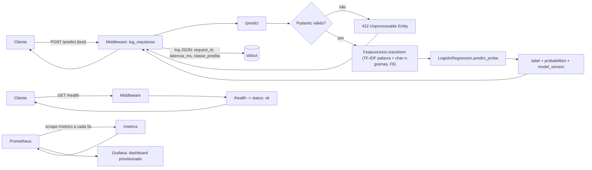
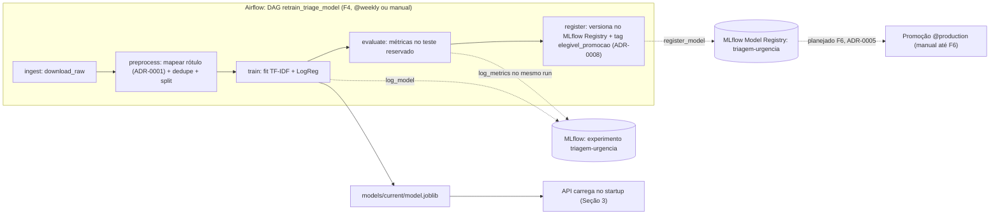

# Arquitetura

> Esqueleto criado em F0, preenchido com o fluxo real em F3. Decisões que geraram
> esta arquitetura estão em `adr/` — aqui descreve-se o **como está**, lá o **por
> quê**. Elementos marcados "planejado" ainda não existem no repositório; os
> diagramas usam seta tracejada (`-.->`) para eles.

## 1. Visão geral

Sistema de triagem de urgência de laudos médicos: classificador NLP leve (TF-IDF +
Regressão Logística, ver ADR-0003) servido por API REST em container, com retreino
orquestrado e observabilidade local.

## 2. Componentes

| Componente | Tecnologia | Porta | Responsabilidade | Status |
|---|---|---|---|---|
| API de inferência | FastAPI + Uvicorn | 8000 | `/predict`, `/health`, `/metrics` | **implementado (F3/F5)** |
| Container | Docker (multi-stage) | — | Empacota a API para deploy | **implementado (F3)** |
| Métricas | `prometheus_client` (`/metrics`) | 8000 | Contadores de requisição/erro, histograma de latência, classe predita | **implementado (F5)** |
| Prometheus | Prometheus v2.53 | 9090 | Coleta de métricas da API (scrape 5s) | **implementado (F5)** |
| Grafana | Grafana 11.1 | 3000 | Dashboard provisionado como código (4 painéis) | **implementado (F5)** |
| Orquestrador | Airflow 3.2 | 8080 | DAG `retrain_triage_model`: ingest→preprocess→train→evaluate→register | **implementado (F4)** |
| Tracking | MLflow | 5000 (UI local) | Experimentos e Model Registry | tracking + registro de versão **em uso (F2-F4)**; promoção de stage planejada (F6) |

## 3. Fluxo de inferência (implementado em F3)



**Startup (não por requisição):** o `lifespan` do FastAPI carrega
`models/current/model.joblib` (pipeline `FeatureUnion` — TF-IDF de palavra
bigrama + TF-IDF de char n-grama (3,5) + marcação de negação — `LogisticRegression`,
representação vencedora da caixa 6.1, persistido por `src/models/train.py`) uma única
vez em `app.state.pipeline` — decisão de F3, registrada em `src/api/main.py` (não
abriu ADR próprio: escolha padrão de baixo risco, ver `docs/PROGRESS.md`).

`/metrics` (F5) expõe `http_requests_total`, `http_request_duration_seconds`
(histograma), `http_errors_total` e `predictions_total` (métrica de negócio —
distribuição de classes preditas, base para detectar drift). Registrado em
`src/monitoring/metrics.py`, chamado pelo mesmo middleware que já loga cada
requisição — uma única passagem, sem medir latência duas vezes.

## 4. Fluxo de treino e retreino (implementado em F1-F4)



Comando manual equivalente às tasks `train`/`evaluate`/`register`:
`make train` (`src/models/train.py`) treina e persiste; a avaliação no teste
reservado e o registro no MLflow Registry só acontecem via DAG hoje. A DAG é
parametrizada (`min_f1_macro`, `max_sub_triagem_increase` — ADR-0008) e roda
ponta a ponta com evidência real em `docs/evidence/f4_dag_execucao_2026-09-14.md`.
Promoção de stage (`@production`) continua decisão manual até a matriz de custo
de ADR-0005 (F6) existir.

## 5. Contratos

`POST /predict`

```json
{ "text": "acute myocardial infarction with cardiogenic shock" }
```

```json
{
  "label": "urgente",
  "probabilities": { "atencao": 0.006, "normal": 0.219, "urgente": 0.776 },
  "model_version": "f6-logreg-negation-charngrams"
}
```

Exemplo real, medido em F3 contra o container (`docs/LATENCY.md`). O texto de
entrada é em **inglês** — idioma do dataset de treino (Medical Abstracts TC Corpus),
decisão consciente registrada em `docs/model_card.md` (limitação 2), não bug.

`GET /health` → `{ "status": "ok" }`

## 6. Decisões vinculadas

| ADR | Decisão | Status |
|---|---|---|
| 0001 | Mapeamento de classes para urgência | aceito |
| 0002 | Arquitetura de deploy (batch vs. real-time) | aceito |
| 0003 | Modelo base | aceito |
| 0004 | Técnica de otimização de latência | planejado (F6) |
| 0005 | Matriz de custo e política de limiar | planejado (F6) |
| 0008 | Estratégia de retreino e critério de promoção | aceito |
